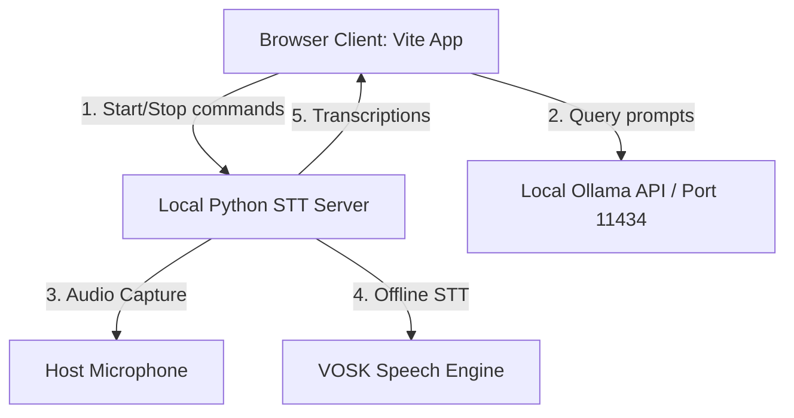

# ✈️ AeroFluency

An advanced, offline-first language learning application designed to help English learners bridge the gap between upper-intermediate (**B2**) and advanced/fluent (**C1**) registers. 

By utilizing local Large Language Models (LLMs) and local Speech-to-Text engines, AeroFluency provides a complete 4-skill deliberate practice suite that runs 100% locally and privately, bypassing corporate web proxies and VPN tunnel restrictions.

---

## 🌟 Key Features

### 1. ✍️ Writing Editor (C1-ify)
* Input your standard drafts (B2 level).
* Receive side-by-side comparative feedback, highlighting basic vocabulary and replacing it with C1 structures (such as inversion, passive voice, nominalization, and advanced transitions).
* Gets a visual metrics grid tracking grammatical complexity and lexical sophistication.

### 2. 📖 Reading Drills (Interactive Collocations)
* Generates challenging C1-level reading passages on random academic topics (philosophy, ethics, science, technology).
* Automatically highlights 3 advanced collocations or idioms with dynamic hover tooltips.
* **Auto-Add to Flashcards**: Click on any highlighted collocation in the text to instantly save it into your spaced-repetition deck!

### 3. 🎧 Listening Summary (Academic Dictation)
* Generates academic lectures read by standard text-to-speech voice models (prioritizing high-quality US English voices).
* Type a summary of the dictation and receive C1-level critiques evaluating your comprehension accuracy.

### 4. 🗣️ Speaking Debate (Offline Speech-to-Text)
* Prompts you with abstract debate questions.
* Captures and transcribes your voice in real-time.
* Evaluates your oral argument's lexical diversity and offers C1-register rewrites.

### 5. 🧠 AeroRepetition (SM-2 Spaced Repetition)
* A vocabulary deck utilizing the **SuperMemo SM-2 Spaced Repetition algorithm**.
* Rates your word recall (`Again`, `Hard`, `Good`, `Easy`) and automatically calculates the next optimal review date to commit collocations to long-term memory.
* Fully editable cards: add custom cards or correct spelling mistakes directly inside the 3D card layout.

---

## 🛠️ Architecture & Core Tech



* **Frontend**: HTML5, Vanilla JavaScript, and Glassmorphism CSS featuring a responsive HSL color system (Harmonious Teal/Cyan theme).
* **Local STT Bridge**: Python HTTP server using `sounddevice` and `vosk` (runs on `localhost:5001`).
* **Local Inference**: Ollama running models like `gemma4` or `qwen2.5:7b` (runs on `localhost:11434`).
* **Cloud Fallbacks**: Integrates Google Gemini (`gemini-1.5-flash`) and Hugging Face serverless APIs for environments with open internet connections.

---

## 🚀 Installation & Setup

### Prerequisites
1. **Python 3.x** installed on your host system.
2. **Node.js & npm** installed on your host system.
3. [Ollama](https://ollama.com/) running locally.
   ```bash
   ollama run gemma4
   ```

### 1. Clone & Install Dependencies
Navigate to your project directories and install packages:

```bash
# Install frontend packages
cd b2-c1-fluent-app
npm install

# Install local speech server dependencies
pip install sounddevice vosk
```

### 2. Startup using the Desktop Shortcuts (Windows)
The repository includes automated background scripts to run both servers concurrently:
1. Double-click the **`AeroFluency`** shortcut icon on your Windows Desktop. This will start the local Python server and the Vite web server silently in the background (no console windows will clutter your screen).
2. Open `http://localhost:5173` in your web browser.
3. Click the **API Settings** gear icon in the bottom-left sidebar to select your Inference Provider (select **Local Ollama** to run 100% offline).
4. **To Turn Off**: Double-click the **`Stop AeroFluency`** shortcut file on your Desktop when you are finished practicing to release your microphone.

---

## 🌿 Git Branch Structure

- **`main`**: Stable release containing the core language app interface.
- **`feature/spaced-repetition-flashcards`**: Development branch containing:
  - Spaced repetition deck (AeroRepetition).
  - Local offline VOSK Speech-to-Text server.
  - VBScript silent background launchers and custom desktop shortcuts.