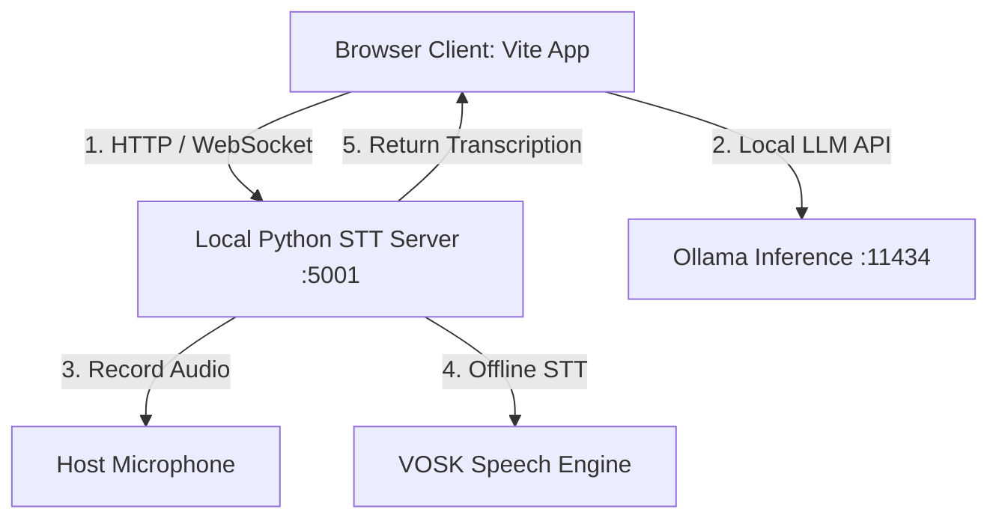

# ✈️ AeroFluency - Chat Summary

This document summarizes the development journey of **AeroFluency**, an offline-first B2-to-C1 Language Fluency application built during this pair-programming session.

---

## 🎯 Project Vision & Goals

**AeroFluency** is designed for English learners aiming to bridge the gap between upper-intermediate (**B2**) and advanced/fluent (**C1**) registers. The core requirements were:
1. **Deliberate 4-Skill Practice**: Writing (C1 upgrading), Reading (Interactive academic texts), Listening (Academic dictation), and Speaking (Real-time oral debate).
2. **Spaced Repetition (AeroRepetition)**: Integrates the **SM-2 algorithm** for flashcard intervals and ease factors to ensure long-term retention.
3. **100% Offline-First Autonomy**: Fully operational behind corporate firewalls and strict proxy tunnels by hosting a local Python speech server (VOSK) and local LLMs (Ollama), alongside public fallback APIs (Gemini & Hugging Face).
4. **Frictionless Desktop Integration**: Single-click silent background launchers and desktop shortcuts for starting and stopping the app.

---

## 🏗️ Technical Architecture & Components

### 1. Web Frontend (Vite App)
* **Location**: `C:\Users\antoi\.gemini\antigravity\scratch\b2-c1-fluent-app`
* **Technologies**: HTML5, Vanilla JavaScript, and Glassmorphic CSS.
* **Key Files**:
  * [index.html](file:///C:/Users/antoi/.gemini/antigravity/scratch/b2-c1-fluent-app/index.html): Defines the structure of the Writing, Reading, Listening, Speaking, and AeroRepetition panels.
  * [src/style.css](file:///C:/Users/antoi/.gemini/antigravity/scratch/b2-c1-fluent-app/src/style.css): Premium design system with fluid custom layouts, teal/cyan gradients, and 3D card-flip animations.
  * [src/main.js](file:///C:/Users/antoi/.gemini/antigravity/scratch/b2-c1-fluent-app/src/main.js): Orchestrates LLM prompt payload formatting, handles the SM-2 flashcard logic, and bridges browser APIs with the local Python audio recorder.

### 2. Local speech server (Python STT Bridge)
* **Location**: `C:\Users\antoi\.gemini\antigravity\scratch\stt_server.py`
* **Technology**: Python, `sounddevice`, `vosk`, and WebSocket/HTTP servers.
* **Role**: Captures microphone audio streams locally and transcribes them on-the-fly using the VOSK speech recognition model, allowing speech evaluation to run entirely offline without internet dependencies.

### 3. Desktop Launchers & Silent Scripts
* **Silent Launcher**: [launcher.vbs](file:///C:/Users/antoi/.gemini/antigravity/scratch/b2-c1-fluent-app/launcher.vbs) starts the Node.js Vite server and Python VOSK server simultaneously in the background without spawning terminal windows.
* **Startup Shortcut**: `AeroFluency.lnk` (located on your Desktop, using the custom teal logo icon).
* **Stop Script & Shortcut**: [Stop_AeroFluency.bat](file:///C:/Users/antoi/.gemini/antigravity/scratch/b2-c1-fluent-app/Stop_AeroFluency.bat) and its corresponding Desktop shortcut `Stop AeroFluency.lnk` (custom red icon) to kill all background Node.js and Python servers instantly.

---

## 🌿 Version Control & GitHub

The project has been organized and pushed to your remote repository at `https://github.com/angra8410/aerofluency-app`:
* **`main`**: The base branch containing the stable core fluency application.
* **`feature/spaced-repetition-flashcards`**: The active feature branch containing the AeroRepetition spaced repetition deck, offline VOSK mic server, background VBS launchers, custom desktop shortcuts, and project documentation.
* **`README.md`**: Created a comprehensive guide explaining features, local installation steps, offline requirements, and VOSK server setups.

---

## 🚀 How to Run the App

1. Turn on **Ollama** locally (e.g. `ollama run gemma4` or similar).
2. Double-click the **`AeroFluency`** shortcut icon on your Windows Desktop to start the background servers silently.
3. Open `http://localhost:5173` in your browser.
4. Click **API Settings** in the bottom-left sidebar to select your Inference Provider (choose **Local Ollama** to run offline).
5. Double-click **`Stop AeroFluency`** on your Desktop when you are finished to stop the background servers.
